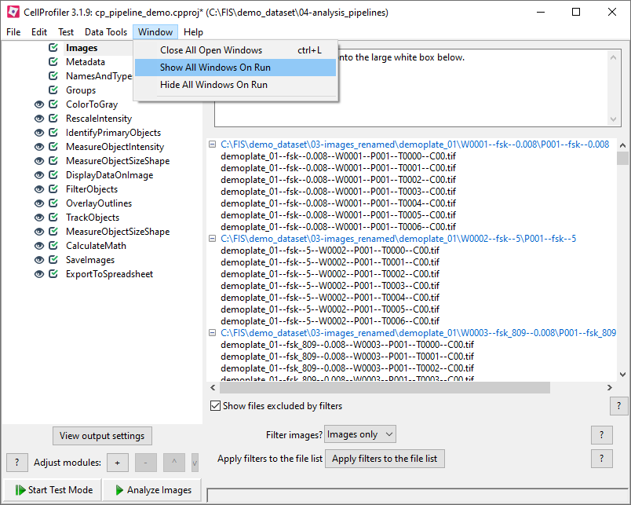
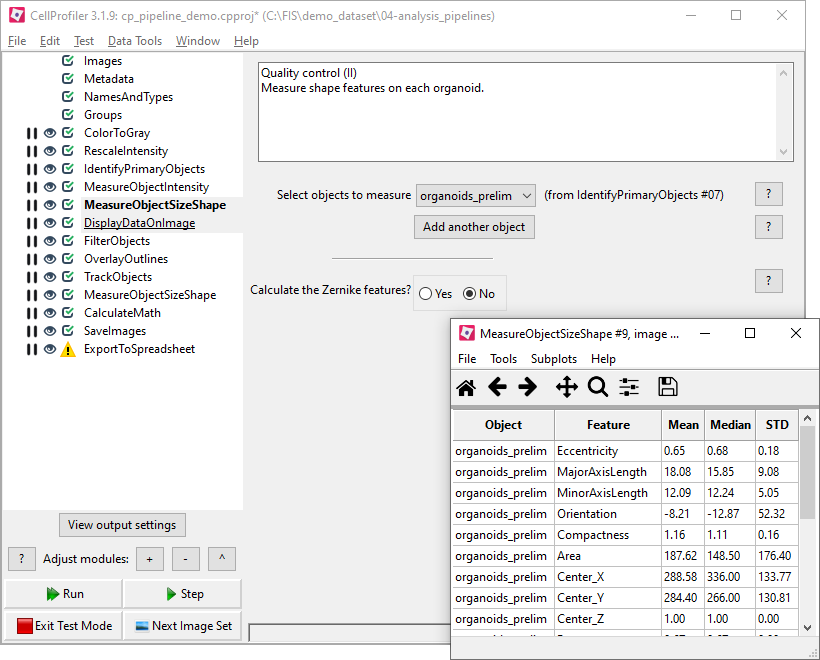
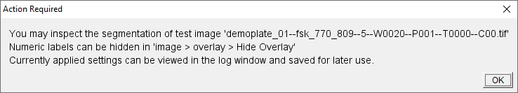
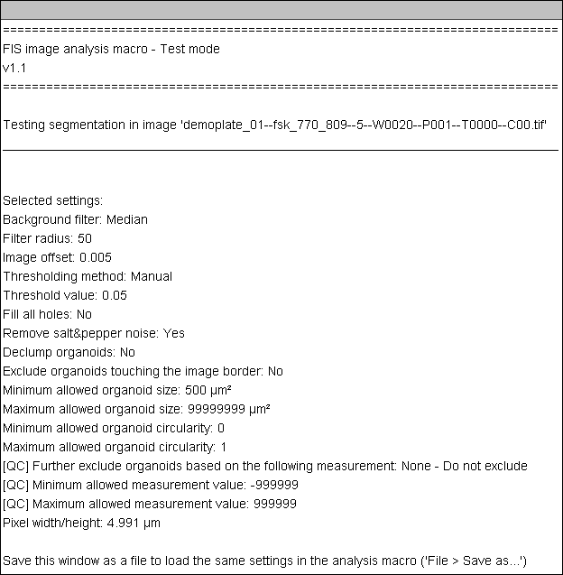
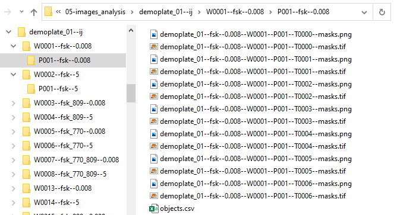

# Image analysis of the forskolin-induced swelling (FIS) assay
*Measurement of organoid features in a live cell microscopy assay with CellProfiler or Fiji/ImageJ*

## Contents
* [1. Overview](#overview)
* [2. Background](#background)
* [3. Setup](#installation)
    * [3.1. CellProfiler analysis](#installation-cp)
    * [3.2. Fiji analysis](#installation-ij)
* [4. Demonstration dataset](#dataset)
    * [4.1. Assay description](#dataset-description)
    * [4.2. File download](#dataset-files)
* [5. Analysis of a demonstration dataset](#analysis)
    * [5.1. CellProfiler analysis](#analysis-cp)
    * [5.2. Fiji analysis](#analysis-ij)
        * [5.2.1. Test mode](#analysis-ij-test)
        * [5.2.2. Batch Analysis mode](#analysis-ij-analysis)
* [6. Citation](#citation)
* [7. References](#references)

## <a name="overview">1. Overview</a>

We provide pipelines for measuring organoid cross-sectional area [[1](#ref01)] in the forskolin-induced swelling (FIS) live cell microscopy assay [[2](#ref02)]. The pipelines take as input raw microscopy images and generate plain text files containing object-level features (*e.g.* organoid cross-sectional area) as well as labelled object masks.

 

 

Equivalent pipelines are available for both **[CellProfiler](https://cellprofiler.org/)** and **[Fiji](http://fiji.sc/) / [ImageJ](https://imagej.nih.gov/ij/)**. See the [background section](#background) for the differences between the two.

## <a name="background">2. Background</a>

The goal of the image analysis of the FIS assay is to determine the cross-sectional area of all organoid on all images. This information can then be further analyzed to determine whether the swelling kinetics is modulated by chemical compounds.

**CellProfiler** is the recommended image analysis software for most FIS image datasets, due to its user friendliness.

The **Fiji** analysis algorithm is recommended in the following cases:

* **Images with irregular fluorescence background or background gradients**

    Background gradients can be removed by applying a pseudo-flat field background correction.

   

* **Assays with large organoid swelling**

    Whenever there is significant organoid swelling calcein fluorescence may become dim due to dye dilution.This may generate two kinds of segmentation artifacts:

    1. *Ring-shaped objects:* A standard thresholding will produce ring-shaped objects due to the low fluorescence intesity in the central region (***Arrows*** in the example below).

    2. *Background segmentation:* To correct artifact #1, the fill holes operation may be applied. However, if organoids are densely seeded, swelling may make them touch each other and fully encircle organoid-free (*i.e.* background) patches. The fill holes operation will attribute these background pixels to one of the organoid objects resulting in an area overestimation. (***Arrowheads*** in the example below).

   

   
   *Segmentation of highly swelling and densely packed organoids, with and without applying the fill holes operation.*

   The Fiji script solves these artefacts by assuming that organoid radial expansion (_i.e._ swelling) is much larger than lateral displacement during the time lapse by applying the following ***conditional fill holes*** procedure:
    
   1. The raw fluorescence image (**A**) is thresholded with holes left unfilled (**B**).

   2. All pixels located in holes in the thresholded image are identified (**C**).

   3. The intersection of hole pixels with the final thresholded image in the previous time point is calculated (**D**). There are no intersecting pixels in the first time point. This image highlights the pixels where fluorescence was diluted below the threshold value since the previous frame.

   4. The final thresholded image is the union of images B and D (**E**).

   

   
   *An example of the **conditional fill holes** algorithm. This time lapse corresponds to a portion of [well B8, #20](./demo_dataset/03-images_renamed/demoplate_01/W0020--fsk_770_809--5/P001--fsk_770_809--5) in the demonstration dataset. Segmentation masks have been re-colored to accurately track objects.*

## <a name="installation">3. Setup</a>

This section describes how to install the software required for image analysis.  

### <a name="installation-cp">3.1. CellProfiler</a>

For the image analysis pipeline using CellProfiler you will need to:

* **Install CellProfiler:** download from [here](https://cellprofiler.org/releases/) and install. Select the version matching your computer's operating system (Windows / macOS) and system architecture (32 / 64 bit). The image analysis pipeline has been developed with CellProfiler 3.1.9.

* **Download CellProfiler project files:** download from [here](./CellProfiler).

### <a name="installation-ij">3.2. Fiji</a>

* **Install Fiji:** download from [here](http://fiji.sc/) and unzip (Windows) or install (macOS). Select the version matching your computer's operating system (Windows / macOS) and system architecture (32 / 64 bit).

* **Download image analysis scripts:** download files from [here](./Fiji_ImageJ).

* **Install scripts (Windows)**

   1. Locate the Fiji installation folder. This is usually `C:\Fiji.app`
   2. In folder `\Fiji.app\scripts` create a new folder named `FIS`.
   3. Copy files `FIS_test....ijm` and `FIS_analysis....ijm` into the `FIS` folder.
   4. Run Fiji.
   5. Fiji will now have a new “FIS” menu:
    
    

    
* **Install scripts (macOS)**
    1. In Finder, go to the Applications folder and locate the Fiji icon
    2. Right click on the Fiji icon and select the `Show Package Contents` option. A 
    3. In folder `Scripts` folder create a new folder named `FIS`.
    4. Copy files `FIS_test....ijm` and `FIS_analysis....ijm`into the `FIS` folder.
    5. Run Fiji.
    6. Fiji will now have a new “FIS” menu:
    
    

## <a name="dataset">4. Demonstration dataset</a>

A demonstration dataset is provided [here](./demo_dataset).

### <a name="dataset-description">4.1. Assay description</a>
The FIS assay was performed with intestinal organoids homozygous for a class II CFTR mutation in the absence (DMSO) or presence of VX-809 and/or VX-770 (3.2 μM), as previously described [[3](#ref03)]. CFTR was activated by addition of forskolin (Fsk) in a concentration range from 0.008 μM – 5 μM. Specimens were laid out in a 96 well plate, as depicted below.

These are the main characteristics of the microscopy images in the demonstration dataset:

- __Imaging system:__ Zeiss confocal microscope
- __Number of plates:__ 1
- __Number of imaged wells:__ 64
- __Number of imaging fields per well:__ 1
- __Number of raw images:__ 448
- __Number of timepoints:__ 7
- __Time interval between frames:__ 10 min
- __Total experiment time:__ 60 min
- __Image resolution:__ 512 x 512 pixels  
- __Pixel dimensions:__ 4.991 x 4.991 μm
- __Image bit depth:__ 8 bit
- __Number of fluorescence channels:__ 1 (calcein green)

The images in the demonstration dataset were renamed with the R package [**htmrenamer**](https://github.com/hmbotelho/htmrenamer) so as to include relevant experimental metadata in the file and folder names (*e.g.* plate name, well number, time lapse sequence number, compound and compound concentration). This simplifies several steps in the image analysis procedure.

### <a name="dataset-files">4.2. File download</a>

The demonstration dataset is comprised of:
1. [**Raw microscopy images**](./demo_dataset/03-images_renamed/demoplate_01) (91.9 MB)
2. [**Image analysis pipeline (CellProfiler)**](./CellProfiler) (1.1 MB)
3. [**Image analysis scripts (Fiji)**](./Fiji_ImageJ) (43 KB)
4. [**Image quantification outputs (CellProfiler)**](./demo_dataset/05-images_analysis/demoplate_01--cellprofiler) (14.8 MB)
5. [**Image quantification outputs (Fiji)**](./demo_dataset/05-images_analysis/demoplate_01--ij) (16.0 MB)

The image analysis pipelines have been pre-configured with optimal parameter values for the demonstration dataset.

## <a name="analysis">5. Analysis of the demonstration dataset</a>

The image analysis process extracts the following features:
* Quantitative measurements (_e.g._ organoid area)
* Experimental metadata (_e.g._ compound and concentration)

The image analysis pipelines perform the following consecutive actions for every image:
1. Background correction
2. Organoid segmentation
3. Quality control: rejection of aberrant organoids (optional)
4. Measurement of organoid area
5. Export of measurements (CSV) and segmentation masks (PNG)

Analysis of the demonstration dataset will produce equivalent results regardless of using CellProfiler or Fiji.

### <a name="analysis-cp">5.1. CellProfiler analysis</a>

This section describes how to analyze the demonstration dataset with CellProfiler. The image analysis pipeline is depicted in the scheme below:

|                                                                 |                                             |
|-----------------------------------------------------------------|---------------------------------------------|
|  |  |

1. Open CellProfiler.

    

<i>View screenshot</i>

    
    An empty CellProfiler window will be displayed.  
    
    

    

2. Load the project file (`*.cpproj`) with `File > Open Project...`. Alternatively, import the pipeline file (`*.cppipe`) with `File > Import > Pipeline from file...`. Both actions are equivalent.

    

<i>View screenshot</i>

    
    The image analysis pipeline is loaded into CellProfiler.  
    Comprehensive information about all CellProfiler features can be obtained by clicking on the  buttons throughout the GUI or in the [online documentation](https://cellprofiler.org/manuals/).  
    
    

    

3. Click on `Window > Show All Windows On Run`. This option will make CellProfiler display all image processing steps as they occur.

    

<i>View screenshot</i>

    
    Selecting the *Show all windows on run* option will render all eye icons solid black , which indicates that the result of each analysis module will be displayed.  
    
    

    

4. The input modules in the left part of the main menu (Images, Metadata, ...) correspond to individual steps in the image analysis pipeline. Clicking on their names will reveal configurable settings.

5. In the **Images** module, remove all previously listed files (drag mouse and press `delete`) and drag [raw microscopy images](./demo_dataset/03-images_renamed/demoplate_01) to the white box named `Drop files and folders here`.

    

<i>View screenshot</i>

    
    The pipeline file, which has been pre-configured for the demonstration dataset, already has the image files listed. To update file locations, first clear the list with the `delete` key or `Right click > Clear File List`. Then, drag files from a local folder in your computer to the `Drop files and folders here` region.  
    
    

    

6. The **Metadata** module extracts text-based information from file and folder names. It requires no changes for images renamed with the [htmrenamer](https://github.com/hmbotelho/htmrenamer) R package, such as the demonstration dataset.

    

<i>View screenshot</i>

    
    Click the  button to confirm that metadata is correctly extracted. In this example one can verify that the well and time numbers, as well as some folder names are being captured. For images not renamed with the [htmrenamer](https://github.com/hmbotelho/htmrenamer) R package the `Regular expression to extract from...` fields may need adjustment.  
    
    

    
    More information on the Metadata module can be obtained on the [CellProfiler manual](http://cellprofiler-manual.s3.amazonaws.com/CellProfiler-3.1.9/modules/input.html?highlight=metadata#module-cellprofiler.modules.metadata).  

    

7. The **NamesAndTypes** module defines a file name feature shared by all raw images. It requires no changes when image file names end in `--C00.tif` or `--C00.ome.tif`. Otherwise, adapt the `Select the rule criteria` as necessary.

    

<i>View screenshot</i>

    
    Click the  button to confirm that the rule criteria finds all microscopy images. In this example, 448 images were found and their file names are shown.  
    
    

    

8. The **Groups** module is used to define which images belong to the same time lapse. This is equivalent to identifying the well where each image was acquired at (*i.e.* the `wellNum` metadata feature captured in step 6). It requires no changes for the demonstration dataset or for images renamed with [htmrenamer](https://github.com/hmbotelho/htmrenamer).    

    

<i>View screenshot</i>

    
    Grouping images by the `wellNum` metadata field will instruct CellProfiler to address all images from the same well as belonging to the same time lapse. In this example, CellProfiler displays the number of time points in each  well: 7. Image analysis will succeed even if images are not grouped, but object tracking results must then be ignored.  
    
    

    

Let us now define image analysis parameters interactively.

9. Enter into **Test Mode** by clicking `Test > Start Test Mode`. The active module will now appear underlined (*e.g.* ). Click on  after each step to examine the output of the active module.

    

<i>View screenshot</i>

    
    In test mode, correctly configured modules will display a  icon. Modules containing errors (*e.g.* references to a non-existing image) will display . In test mode, the `ExportToSpreadsheet` will always display . The 4 buttons at the botton left of the window can be used to navigate through images and execute modules.   
    

    

10. Go to  `Test > Choose Image Group` to select a well to test the image analysis settings on. We will use [well B8 (well #20) from the demonstration dataset](./demo_dataset/03-images_renamed/demoplate_01/W0020--fsk_770_809--5/P001--fsk_770_809--5) as an example.

    

<i>View screenshot</i>

    
    Selecting a well (*i.e.* time lapse) to test whether the image analysis settings are adequate.  
    
    

    

11. The **ColorToGray** module either selects the green channel (RGB images) or does nothing at all (grayscale images). It requires no changes.

    

<i>View screenshot</i>

    
    When clicking `Step` the result of this module is shown.  
    
    

    

    

12. The **RescaleIntensity** module stretches pixel grey values to the full intensity range to maximize the dynamic range and remove background offsets. It requires no changes.

    

<i>View screenshot</i>

    
    When clicking `Step` the result of this module is shown.  
    
    

    

    

13. The **IdentifyPrimaryObjects** module performs organoid segmentation and is the most step in the analysis. With the exception of `Name the primary objects to be identified` all settings may need to be adjusted for each experiment. The following settings need adjustment most often:  
    - **Typical diameter of objects:** In pixel units. The minimum and maximum size of a circle with the same area as the organoids. Organoids outside this range will be discarded.
    - **Threshold correction factor:** Controls threshold stringency. A factor of 1 means no adjustment, 0 to 1 lowers the threshold value and > 1 increases the threshold value. 
    
    The following may also need occasional adjustment:  
    - **Threshold smoothing scale:** Controls image smoothing before the thresholding step. Images with noise usually require more smoothing.
    - **Lower and upper bounds on threshold:** Range: [0 ~ 1]. Defines the range where the threshold value will be in.
    - **Method to distinguish clumpled objects:** Setting to distinguish identified objects as single organoids or several ones touching each other.
    - **Method to draw dividing lines between clumpled objects:** Setting to separate organoids classified as being in a group of touching organoids.
    - **Size of smoothing filter:** Controls image smoothing during the declumping process of clumped objects.
    - **Suppress local maxima that are closer than...:** In pixel units. Defines the maximum radius in which only 1 organoid should be present (the approximate radius of the smallest expected organoid).
    - **Fill holes in identified objects:** Allows for filling holes of the identified objects after thresholding of the image. When calcein labelling is intense across all wells and time points, `Never` should be selected, as this typically results in less artefacts. However, when there is significant organoid swelling calcein fluorescence is frequently low in the lumen producing objects with holes. We recommend selecting `After both thresholding and declumping` when this occurs. Filling holes may produce an overestimation of organoid size if densely packed organoids touch each other and produce voids (see below).
    
    

    
    *Fluorescence image before and after thresholding with and without `Fill holes after both thresholding and declumping`. Note that not filling holes produces an unsatisfactory segmentation with ring-shaped organoids (arrows). When Fill Holes is enabled, most organoids are correctly segmented but a background region is wrongly classified as object at the 40 min frame (arrowhead).*
    *To test this time lapse experiment in CellProfiler select `Test > Choose Image Group > Metadata_wellNum=0020` and `Test > Choose Image Set` to select each time point. Segmentation masks have been re-coloured to accurately track objects. Panels show a portion of the entire image.*

    

<i>View screenshot</i>

    
    When clicking `Step` the result of this module is shown. Use the zoom and panning controls to examine whether all organoids are segmented appropriately. If any of the segmentation settings is changed, click `Step` to refresh the results window.  
    
    

    

14. The **MeasureObjectIntensity** module gathers features for quality control in step 17. It requires no changes.

    

<i>View screenshot</i>

    
    When clicking `Step` CellProfiler shows summary statistics for a variety of intensity measurements across all objects in the image. Individual, per-object values are recorded but not shown to the user.  
    
    

    

15. The first **MeasureObjectSizeShape** module gathers features for quality control in steps 16 and 17. It requires no changes.

    

<i>View screenshot</i>

    
    When clicking `Step` CellProfiler shows summary statistics for a variety of morphometric measurements across all objects in the image. Individual, per-object values are recorded but not shown to the user.  
    
    

    

16. The **DisplayDataOnImage** module is involved in object-level quality control. It overlays object features on top of each organoid to inform the user's decision on selecting thresholds to exclude undesired objects.

    

<i>View screenshot</i>

    
    The measurement selected on `Measurement to display` will be displayed on top of the object which produced it. Click `Step` to view the image overlay.  
    
    

    

17. The **FilterObjects** module allows excluding individual organoids based on fluorescence intensity of morphological features. In the `Category` and `Measurement` boxes select the feature chosen in step 16. In `Minimum value` and `Maximum value` insert the range of allowed values. Organoids with values outside this range will be discarded. Below is an example where  [FormFactor](http://cellprofiler-manual.s3.amazonaws.com/CellProfiler-3.0.0/modules/measurement.html) allows for a perfect discrimination of live (FormFactor ≥ 0.5) and dead (FormFactor = 0.22) organoids.

    

    
    *An example where objects with FormFactor > 0.3 were approved thereby excluding irregular structures surrounded by cell clumps from the analysis (arrowhead). Segmentation masks show the identified objects from the segmentation step (`organoids_prelim`) and identified objects by applying the quality control criteria (`organoids`). Panels show a portion of the images from [well H4, #88](./demo_dataset/03-images_renamed/demoplate_01/W0088--fsk_809--0.32/P001--fsk_809--0.32) from the demonstration dataset. To test this image select `Test > Choose Image Group > Metadata_wellNum=0088`.*
 
    

<i>View screenshot</i>

    
    When clicking `Step` CellProfiler shows the impact of applying the quality control thresholds. **In the demonstration dataset analysis all objects were approved** because 0 ≤ [FormFactor](http://cellprofiler-manual.s3.amazonaws.com/CellProfiler-3.0.0/modules/measurement.html) ≤ 1. Selecting `Minimum value` ≤ 0 and `Maximum value` ≥ 1 would produce the same outcome.  
    
    

    

18. The **OverlayOutlines** module  provides an alternative way of visualizing filtered objects. Outlines of approved organoids are displayed on the fluorescence microscopy image. This module requires no changes.

    

<i>View screenshot</i>

    
    When clicking `Step` CellProfiler shows the outlines of approved objects overlayed on the fluorescence microscopy image.  
    
    

    

19. The **TrackObjects** module assigns a unique numeric label to the same organoid across all time lapse frames. `Maximum pixel distance to consider matches` should be adjusted to the maximum number of pixels an organoid is expected to drift along two consecutive  frames. If `Minimum lifetime` is adjusted to be *n* - 1, where *n* is the number of time points in the time lapse, organoids which are not tracked throughout the entire time lapse (*e.g.* organoids that touch one another and are not declumped) will be assigned the reference *NaN*. This can optionally be used to exclude those organoids from data analysis.  

    

<i>View screenshot</i>

    
    When clicking `Step` CellProfiler shows segmentation masks colored by the tracked object identity number. The same object is expected to have the same identity number across time frames.  
    
    

    

20. The second **MeasureObjectSizeShape** module measures organoid area and requires no changes.

21. The **CalculateMath** module converts the pixel size to micron units and must always be checked. Fill the `Multiply the above operand by` field with the square of the pixel width/height (_e.g._ if the pixel dimensions are 4.991 × 4.991 μm, the conversion factor is 24.910081).

    

<i>View screenshot</i>

    
    Input the size conversion factor in the numeric field. The area values obtained for each organoid (pixel units) will be multiplied by this value.  
    
    

    

22. The **SaveImages** saves the segmentation masks as PNG files and requires no changes.

23. The **ExportToSpreadSheet** module exports image features in tabular text files and requires no changes.

**Note:** To ensure that the selected analysis settings are suitable for the entire dataset, several images should be tested. Segmentation (step 13) is frequently the step requiring the most adjustments. To test images from another well select `Test > Choose Image Group`. To test a specific time point image select `Test > Choose Image Set`. Test mode must be enabled.

24. In **View output settings**, under **Default Output Folder** specify where to store the analyzed data.

    

<i>View screenshot</i>

    
    Click the  button and enter a folder location in `Default Output Folder`  
    
    

    

25. Save a copy of the CellProfiler project by clicking `File > Save Project As...`.

26. Before running the analysis activate `Window > Hide All Windows On Run`.

27. Start the analysis of the whole dataset by clicking on the  button. In a computer with a ~2.5 GHz quad core processor analysis of the demo dataset should take about 10 minutes .

28. CellProfiler will produce an output folder identified by the `--cellprofiler` suffix. [See example here](.demo_dataset/05-images_analysis/demoplate_01--cellprofiler).

    

<i>View screenshot</i>

    
    Analysis results will be saved in a folder structure resembling the raw data, containing the segmentation masks for all images stored as PNG files, as well as CSV files named `objects.csv` which contain quantitative features and metadata.  
    
    

    

One `objects.csv` file is generated for each well in the assay plate. Each line in this file refers to one object (*i.e.* organoid) on an image, and each column is one feature for that object. The contents of each column in the `objects.csv` file are described below.

| Column name                | Description |
|----------------------------|----|
| **ImageNumber**            | The image index in the dataset. *e.g.:* 1, 2, 3, ... |
| **ObjectNumber**           | The object index within the image. *e.g.:* 1, 2, 3, ... |
| **Metadata_Channel**       | The imaging channel index for calcein green fluorescence. *e.g.:* 0 |
| **Metadata_FileLocation**  | The location of the fluorescence image in the computer where the CellProfiler pipeline was run. |
| **Metadata_Frame**         | The index of the stack frame or movie time point. It is always 0 because the TIF files contain one single two-dimensional image. |
| **Metadata_Series**        | The index of the stack containing this image within the file. It is always 0 because the TIF files contain one single two-dimensional image. |
| **Metadata_compound**      | The compound added to organoids in this well. |
| **Metadata_concentration** | The compound concentration in this well. |
| **Metadata_imageBaseName** | The image file name without the channel suffix. |
| **Metadata_pathBase**      | The location of the parent of the folder containing all images from a FIS assay plate in the computer where the CellProfiler pipeline was run. |
| **Metadata_plateName**     | The name of the FIS assay plate. |
| **Metadata_platePath**     | The name of the folder containing all images from a FIS assay plate. |
| **Metadata_posNum**        | The sub-position index of this image within the well. It is always 1. |
| **Metadata_posPath**       | The name of the folder containing all images from a single imaging field (*i.e.* sub-position). |
| **Metadata_timeNum**       | The time frame index of this image. |
| **Metadata_wellNum**       | The well number index regarding this image. |
| **Metadata_wellPath**      | The name of the folder containing all images from a given well. |
| **AreaShape_Center_X**     | The x-position of the centroid of the segmentation mask for this object. Pixel units. |
| **AreaShape_Center_Y**     | The y-position of the centroid of the segmentation mask for this object. Pixel units. |
| **Math_area_micronsq**     | The area of this object in micron square units. |
| **TrackObjects_Label_4**   | The tracking object label. The same object is expected to receive the same label across different time points in the time course. The number in the column name indicates the maximum pixel displacement across time points selected in CellProfiler. |

The `Math_area_micronsq` measurements can be converted into the area under the curve (AUC) using a tool like [Organoid Analyst](https://github.com/hmbotelho/organoid_analyst).

### <a name="analysis-ij">5.2. Fiji analysis</a>

This section describes how to analyze the demonstration dataset with Fiji. The image analysis pipeline is depicted in the scheme below:

The Fiji workflow comprises two scripts:
* The **test** script is used to test single images and determine the analysis parameters for optimal segmentation.
* The **analysis** script processes a complete dataser using the parameters determined above.

#### <a name="analysis-ij-test">5.2.1. Test mode</a>

1. Open Fiji.

    

<i>View screenshot</i>

    
    The Fiji window will be displayed. The **FIS** menu should be visible. Running the standard ImageJ is equivalent.  
    
    

    

2.  Open an image (`File > Open...`) to optimize the analysis settings. For this example use the [first time point from well B8 (#20) from the demonstration dataset](./demo_dataset/03-images_renamed/demoplate_01/W0020--fsk_770_809--5/P001--fsk_770_809--5/demoplate_01--fsk_770_809--5--W0020--P001--T0000--C00.tif) as an example.

    

<i>View screenshot</i>

    
    Opening a fluorescence image with Fiji.  
    
    

    

3. Start the test mode by selecting `FIS > FIS test...`.

    

<i>View screenshot</i>

    
    

    

4. The test mode window will open.

    

<i>View screenshot</i>

    
    

    

5. Define analysis parameters for the selected image:  

    **Background filter:** The filter which generates a pseudo-flat field from the fluorescence image. Minimum, median and mean filters are availalbe. The pseudo-flat field will be subtracted to the raw fluorescence image to generate a background corrected image. Selecting `No filter (flat background)` disables this correction.  
    **Radius of filter:** The radius of the background filter, in pixel units. Disregarded if `No filter (flat background)` is selected.  
    **Offset after background correction:** This value will be subtracted from all pixels after background correction, regardless of the background filter option. Offsetting may be necessary when the fluorescence baseline is not zero after the pseudo-flat field correction.  
    **Manual threshold value:** This will be applied after pseudo-flat field subtraction, offset correction and grey value rescaling to [0 ~ 1]. All pixels above this grey value will be assigned to objects (organoids).  
    **Fill all holes:** When unchecked, the conditional fill holes algorithm is applied. When checked, all holes are filled after the thresholding step.  
    **Remove salt and pepper noise:** When checked, isolated pixels in the thresholded image will be removed.  
    **Font size for organoid labels:** Each segmented organoid will be overlaid with a unique label having this font size.  
    **Exclude objects touching the image border:** When checked, all objects which touch the image border on each image will be discarded from the analysis. Do note that organoids that do not touch the image border at the beginning of the time course may do so due to swelling. Activating this option may cause that some objects are accepted at the beginning of the time lapse (when they are unswollen) but discard their swollen forms at later time points, as they touch the border.  
    **Minimum organoid area:** Minimum allowed size of organoids (in μm² units). Smaller objects (*e.g.* debris) will be discarded from the analysis.  
    **Maximum organoid area:** Maximum allowed size of organoids (in μm² units). Larger objects will be discarded from the analysis.  
    **Minimum organoid circularity:** Minimum allowed circularity of organoids. Organoids with lower circularity will be discarded from the analysis. **Note:** 0 ≤ circularity ≤ 1  
    **Maximum organoid circularity:** Maximum allowed circularity of organoids. Organoids with higher circularity will be discarded from the analysis. **Note:** 0 ≤ circularity ≤ 1  
    **Exclude organoids based on measurement:** Besides area and circularity, an additional feature can be selected here for additional object-level quality control purposes. A common use case is to use this option to discard dead organoids.  
    **Minimum allowed value:**  Minimum allowed value for the additional quality control measurement. Organoids with smaller values will be discarded from the analysis.  
    **Maximum allowed value:** Maximum allowed value for the additional quality control measurement. Organoids with larger values will be discarded from the analysis.  
    **Pixel width/height:** Pixel size in the raw microscopy image. This is used to set the image scale throughout the test and analysis processes.  

6. Click the `OK` button to test the analysis settings in the open image.  

7. Fiji will apply the test settings display the results of each analysis step. Images are numbered according to the sequence of operations.  

    

<i>View screenshot</i>

    
    Applying the [default test parameters](#parameters-ij) to the [first time point from well B8 (#20) from the demonstration dataset](./demo_dataset/03-images_renamed/demoplate_01/W0020--fsk_770_809--5/P001--fsk_770_809--5/demoplate_01--fsk_770_809--5--W0020--P001--T0000--C00.tif).  
    
    

    

    * **Raw image:** A copy of the test image.

        

<i>View screenshot</i>

    
        The lower plot is the [grayvalue profile](https://imagej.nih.gov/ij/docs/menus/analyze.html#plot) across the red dashed line. Notice the non-homogenous background: higher intensities in the center of the image and lower intensities at the edges.  
        
        

        

    * **16 bit conversion:** Conversion of the test image into a 16 bit grayscale image. This ensures that both single and multichannel images are appropriately processed.  

        

<i>View screenshot</i>

    
        The lower plot is the [grayvalue profile](https://imagej.nih.gov/ij/docs/menus/analyze.html#plot) across the red dashed line. In the demonstration dataset pixel values are not modified.  
        
        

        

    * **Pseudo flat field:** A “background-only” image produced by applying the background filter to the 16 bit image. This image is not generated if `No filter (flat background)` is selected.  

        

<i>View screenshot</i>

    
        The lower plot is the [grayvalue profile](https://imagej.nih.gov/ij/docs/menus/analyze.html#plot) across the red dashed line. The pseudo-flat field image estimates the background grayvalues of the raw image: higher values in the center of the image and lower values at the edges. The discreteness in the profile plot (grayvalues ∈ {0, 1, 2, 3} arises because of modest background inhomogeneity.  
        

        

    * **Background correction (with offset):** The result of subtracting the pseudo-flat field to the 16 bit image. If `No filter (flat background)` is selected, this image is identical to the raw one.  

        

<i>View screenshot</i>

    
        The lower plot is the [grayvalue profile](https://imagej.nih.gov/ij/docs/menus/analyze.html#plot) across the red dashed line. Notice how the pseudo-flat field correction produced a homogenous background throughout the image.  
        
        

        

    * **Background correction (with offset, rescaled):** The previous image with grayvalues rescaled to the [0 ~ 1] range.

        

<i>View screenshot</i>

    
        The lower plot is the [grayvalue profile](https://imagej.nih.gov/ij/docs/menus/analyze.html#plot) across the red dashed line. Notice how the average background intensity is not zero, but is rather offset by ~0.005 (red dashed line in the profile plot).  
        
        

        

    * **Background corrected:** The previous image after subtraction of the background offset.

        

<i>View screenshot</i>

    
        The lower plot is the [grayvalue profile](https://imagej.nih.gov/ij/docs/menus/analyze.html#plot) across the red dashed line. Manual thresholding will be applied to this image using the value specified in the test mode dialog box. Notice how a threshold value of e.g. 0.05 (red dashed line in the profile plot) allows an excellent discrimination between background and object pixels.  
        
        

        

    * **Thresholded image:** Manual thresholding of the previous image.

        

<i>View screenshot</i>

    
        Image thresholding produced some isolated "object"/bright pixels (similar to salt and pepper noise). These can be removed if requested.  
        
        

        

    * **Salt and pepper noise removed:** If requested, isolated thresholded pixels can be removed.

        

<i>View screenshot</i>

    
        Removing salt and pepper noise in the thresholded image improves the visualization of segmented objects.  
        
        

        

    * **Final:** Segmentation masks of accepted organoids.

        

<i>View screenshot</i>

    
        For individual object analysis, gates for the size, circularity and other object-level features can be specified. In this example, only organoids larger than 500 μm² were accepted, regardless of all other features. Objects touching the image border were accepted. Each object is overlaid with a cyan label. Labels are shown in all images at the same location, to inform the segmentation process. Labels can be hidden by selecting `Image > Overlay > Hide Overlay`.  
        
        

        

8.	The `Results` will display the features of all objects, which may be used to determine object-level quality control values.

    

<i>View screenshot</i>

    
    Each line corresponds to one object. The first column is the cyan label overlaid on each organoid:  
    
    

    
    The table contains standard [ImageJ measurements](https://imagej.nih.gov/ij/docs/guide/146-30.html#toc-Subsection-30.7), as well as CellProfiler's [FormFactor](http://cellprofiler-manual.s3.amazonaws.com/CellProfiler-3.0.0/modules/measurement.html).
        
    

9. Inspect the `ORGANOIDS_FINAL` image to judge the quality of background subtraction, segmentation and object/level quality control. We recommend the [plot profile tool](https://imagej.nih.gov/ij/docs/menus/analyze.html#plot) for image examination.

10. Click the `OK` button in the box below to return to the test mode tool:
    

11. The log window will display the most recent analysis settings.

    

<i>View screenshot</i>

    
    

    

12. The test tool will allow changing the analysis settings. Adjust parameters until an adequate segmentation is obtained.

13. When appropriate segmentation and quality control parameters have been found, click `Cancel` or `X` to exit the test mode.

**Note:** To ensure that the selected analysis settings are suitable for the entire dataset, several images should be tested. Make all required adjustments until a satisfactory analysis is consistently achieved.
    

#### <a name="analysis-ij-analysis">5.2.2. Batch Analysis mode</a>

1. Open Fiji.

    

<i>View screenshot</i>

    
    The Fiji window will be displayed. The **FIS** menu should be visible. Running the standard ImageJ is equivalent.  
    
    

    

2. Start the batch analysis mode by selecting `FIS > FIS analysis...`.

    

<i>View screenshot</i>

    
    

    

3. The batch analysis window will open.

    

<i>View screenshot</i>

    
    

    

4. Enter the parameters selected in the test mode. For batch analysis, 3 additional parameters are required:

    * **Regular expression matching all files being analyzed**: the default expression `.*--C00(?:.ome)??.tif$` will match the images generated by the `htmrenamer` tool. If needed, replace `C00` with the channel name for the fluorescence image.  
    
    * **Folder location > Raw FIS images**:  The folder containing renamed fluorescence images. [See example here](./demo_dataset/03-images_renamed/demoplate_01).  
    
    * **Folder location > Results**: The folder where analysis results will be saved.   
    
    The demo dataset was analyzed using the following settings:

    

    | **Parameter**                                | **Value**              |
    |----------------------------------------------|------------------------|
    | _Background filter_                          | Median                 |
    | _Radius of filter_                           | 50                     |
    | _Offset after background correction_         | 0.005                  |
    | _Manual threshold value_                     | 0.05                   |
    | _Fill all holes?_                            | No                     |
    | _Remove salt and pepper noise?_              | Yes                    |
    | _Exclude objects touching the image border?_ | No                     |
    | _Minimum organoid size_                      | 500 μm²                |
    | _Maximum organoid size_                      | 99999999 μm²           |
    | _Minimum organoid circularity_               | 0                      |
    | _Maximum organoid circularity_               | 1                      |
    | _Exclude organoids based on measurements?_   | None - Do not exclude  |
    | _Minimum allowed value_                      | _Irrelevant_           |
    | _Maximum allowed value_                      | _Irrelevant_           |
    | _Pixel width/height_                         | 4.991 μm               |
    | _Regular expression_                         | .*--C00(?:.ome)??.tif$ |

5. Click `OK` to start the analysis.

    Analysis of the demo dataset should take about 20 minutes on a computer with a ~2.5 GHz quad core processor.

6.	The Fiji analysis will produce a results folder with a `--ij` suffix. [See example here](./demo_dataset/05-images_analysis/demoplate_01--ij).

    

<i>View screenshot</i>

    
    The file and folder structure of the Fiji analysis results resembles the raw data.
    
    Analysis settings will be stored in a file named `settings_YYYY-MM-DD_HH-MM.log` (not shown in the image). This file will be saved in the root `--ij` folder.  
    
    

    

    The output files are segmentation masks (PNG, one per time frame) and CSV files (one per well) that contain quantitative features (_e.g._ organoid area) and metadata. 
           
    Each line of the CSV filesin one object

    | Column name                | Description |
    |----------------------------|----|
    | **ImageNumber**            | The image index in the dataset. |
    | **ObjectNumber**           | The object index within the image. |
    | **Metadata_Channel**       | The imaging channel index for calcein green fluorescence. |
    | **Metadata_FileLocation**  | The location of the fluorescence image in the computer where analysis was run. |
    | **Metadata_compound**      | The compound added to organoids in this well. |
    | **Metadata_concentration** | The compound concentration in this well. |
    | **Metadata_imageBaseName** | The image file name without the channel suffix. |
    | **Metadata_pathBase**      | The location of the parent of the folder containing all images from a FIS assay plate in the computer where analysis was run. |
    | **Metadata_plateName**     | The name of the FIS assay plate. |
    | **Metadata_platePath**     | The name of the folder containing all images from a FIS assay plate. |
    | **Metadata_posNum**        | The sub-position index of this image within the well. |
    | **Metadata_posPath**       | The name of the folder containing all images from a single imaging field (*i.e.* sub-position). |
    | **Metadata_timeNum**       | The time frame index of this image. |
    | **Metadata_wellNum**       | The well number index regarding this image. |
    | **Metadata_wellPath**      | The name of the folder containing all images from a given well. |
    | **AreaShape_Center_X**     | The x-position of the centroid of the segmentation mask for this object. Pixel units. |
    | **AreaShape_Center_Y**     | The y-position of the centroid of the segmentation mask for this object. Pixel units. |
    | **Math_area_micronsq**     | The area of this object in micron square units. |
    | **TrackObjects_Label**     | The object index within the image. |

    The `Math_area_micronsq` measurements can be converted into the area under the curve (AUC) using a tool like [Organoid Analyst](https://github.com/hmbotelho/organoid_analyst).

## <a name="references">6. Citation</a>
<a name="ref01">[1]</a> Hagemeijer *et al* (2020) **An open-source high-content analysis workflow for CFTR function measurements using the forskolin-induced swelling assay** *submitted*

## <a name="references">7. References</a>
<a name="ref02">[2]</a> Dekkers *et al* (2013) **A functional CFTR assay using primary cystic fibrosis intestinal organoids**. *Nat Med* 19, 939-945. [https://doi.org/10.1038/nm.3201](https://doi.org/10.1038/nm.3201)

<a name="ref03">[3]</a> Dekkers *et al* (2016) **Characterizing responses to CFTR-modulating drugs using rectal organoids derived from subjects with cystic fibrosis**. *Sci Transl Med* 8(344), 344ra84. [https://doi.org/10.1126/scitranslmed.aad8278](https://doi.org/10.1126/scitranslmed.aad8278)
